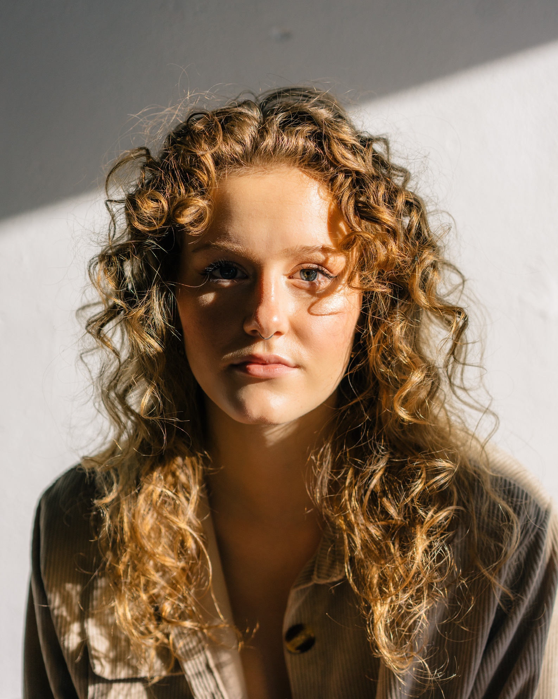

# About

ABOUT

Hello! I'm Lo, a Colorado-born artist, designer, and educator with a passion for architecture, environmental design, and cultural integration.

My interest in design deepened after high school, leading me to study Architecture and Environmental Design at the University of Westminster, where I explored sustainable building practices, urban planning, and community-driven spaces. Throughout my studies, I worked on a range of projects, from small-scale material explorations to large-scale urban interventions, earning recognition for my conceptual and technical work.

​
Beyond academics, I’ve sought hands-on experience in different environments. I earned a yoga teaching certification, worked as a farm assistant, and engaged with diverse communities to better understand the intersection of design, the environment, and social spaces.

Currently, I'm taking up a degree in Design for Emerging Futures in Barcelona at the Institute of Advanced Architecture Catalunia. My goal is to integrate architecture, public space, and environmental consciousness in ways that foster inclusivity and meaningful connections. I intend to focus on food systems and argriculture, coining myself as a "food architect", I plan to follow the river of nourishment -- and inject care into each step of our cunsumption flow -- cultivation,  preparation, and continuaton.

Welcome and I hope you enjoy!

 **[my website](https://community.emergentfutures.io/courses/5566525/content)**

